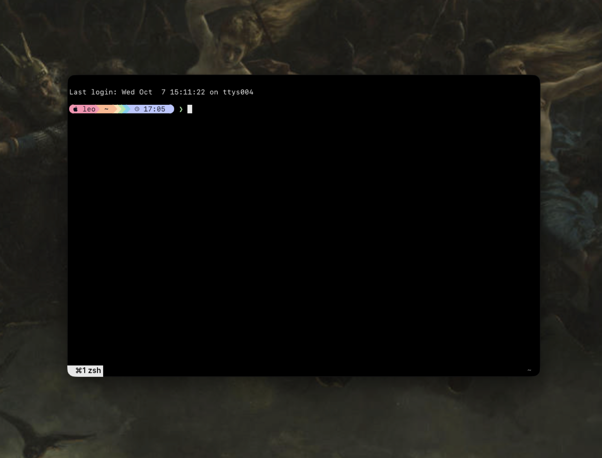

<h1 align="center">Termi</h1>

<p align="center"><a href="https://mrlemoos.dev/termi">mrlemoos.dev/termi</a></p>

<p align="center"></p>

macOS terminal for coding agents. No chrome: traffic lights only appear when you hover the top edge.

## Install

Download the app from [mrlemoos.dev/termi](https://mrlemoos.dev/termi), or use Homebrew:

```sh
brew tap mrlemoos/termi https://github.com/mrlemoos/Termi
brew install --cask termi
```

In Finder, right-click selected files or folders and choose **Services → Open in Termi**. Folders open as new tabs; files open their parent folder. Selecting several files in the same folder opens one tab. Launch Termi once after installing or updating to register the Service. If it is hidden, enable it in System Settings → Keyboard → Keyboard Shortcuts → Services.

Agent notifications use Termi's name and icon. macOS asks for permission when Termi first sends a notification. Notification preferences are in System Settings → Notifications → Termi; ⌘, toggles them inside Termi. Native notifications require the bundled app, so `cargo run` does not send them.

## Keys

| Key | Action |
|-----|--------|
| ⌘T / ⌘W | new / close tab |
| ⌘1…⌘9 | jump to tab (the status line always shows them) |
| ⌘B | file tree. Click a file to open it, drag it onto the terminal to insert `@path` |
| ⌘C / ⌘V | copy selection / paste |
| ⌘, | settings (↑↓ move, space toggle, esc close). Saved to `~/.config/termi/settings` |

Glass mode supports wave or still light. In settings, glass opacity ranges from 0.0 clear to 1.0 solid; ←→ adjusts by 0.01. The default is 0.86.

### Editor

| Key | Action |
|-----|--------|
| ⌘S | save |
| ⌘E | toggle Markdown preview/source |
| ⌘' or click line number | add note to that source line |
| ⌘↵ | paste every note into the agent as a review prompt |
| Esc | close |

`.md` and `.markdown` files open in preview. Click `preview | source` or press ⌘E to edit raw Markdown. Preview includes unsaved edits; ⌘S saves the source. Switching views preserves edits and review notes. Notes can be added in source only.

Preview renders headings, emphasis, lists, links, fenced code, tables and read-only task lists in terminal fonts. Emphasis is underlined. Images show `[Image: alt text]` or `[Image: no alt text]`; HTML shows `[HTML: not rendered]`. Images aren't fetched and HTML isn't executed.

Web links open in your browser. Relative Markdown links open in Termi, starting at the top of the file. File navigation, including the tree, blocks while edits are unsaved. Save, then select the destination again; or press Esc twice to discard and close first.

## Agents

claude, codex, grok, and cursor-agent are detected from the tab's foreground process. Each one gets its own mascot.

Agent state is read from the screen. Hooks are a fallback: any hook can write `idle`, `working`, or `input` to `$TERMI_STATE_DIR/$TERMI_TAB`.

Claude Code example (`~/.claude/settings.json`):

```json
{
  "hooks": {
    "UserPromptSubmit": [{ "hooks": [{ "type": "command", "command": "[ -n \"$TERMI_TAB\" ] && echo working > \"$TERMI_STATE_DIR/$TERMI_TAB\" || true" }] }],
    "Notification":     [{ "hooks": [{ "type": "command", "command": "[ -n \"$TERMI_TAB\" ] && echo input > \"$TERMI_STATE_DIR/$TERMI_TAB\" || true" }] }],
    "Stop":             [{ "hooks": [{ "type": "command", "command": "[ -n \"$TERMI_TAB\" ] && echo idle > \"$TERMI_STATE_DIR/$TERMI_TAB\" || true" }] }]
  }
}
```

## Build

- Dev: `cargo run`
- Release: every push to `main` runs tests and builds an Apple Silicon app, publishes `Termi.zip` to a GitHub production release, and commits its version and SHA-256 to `Casks/termi.rb`. The version uses Cargo's major/minor and adds the workflow run number to its patch. The cask update uses GitHub's token, so it does not trigger another release. Failed runs can be rerun from Actions.
- Local bundle: `sh scripts/bundle.sh` builds `dist/Termi.app` and `dist/Termi.zip`, then updates `Casks/termi.rb`. Set `RELEASE_VERSION` to override the Cargo version.
- Set `SIGNING_IDENTITY` to your certificate name or SHA-1 to sign the local bundle. Without it, bundles use ad hoc signing. Downloads need a Developer ID Application certificate and notarisation to pass Gatekeeper.

## License

Apache 2.0, see `LICENSE`.

The MesloLGS Nerd Font Mono is compiled into the binary (Apache 2.0, see `assets/MESLO-LICENSE.txt`).
